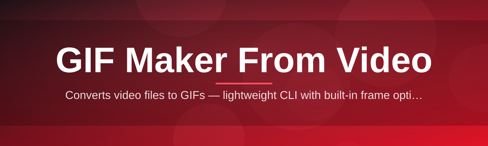
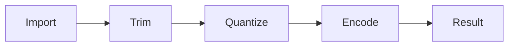

# gif-maker-video-editor 🎬✨

  

*Turn any video clip into a looping GIF in the time it takes to say "render."*

  

## 🌱 Overview

**gif-maker-video-editor** started as a weekend itch — I was tired of dragging clips into three different tools just to get a clean, small, shareable GIF out the other end. So this project exists to do one job and do it obsessively well: **convert video into GIF**, with a real editor sitting in the middle instead of a bare command-line wrapper.

This is a **GIF maker from video** built for people who actually care about the output — streamers trimming clip highlights, developers making README demos, meme-makers who want crisp frames instead of muddy compression, and anyone who just needs a `.mp4` to become a `.gif` without installing a suite of bloated software. Every control in the timeline exists because I personally needed it while cutting my own clips.

It's a passion project, not a corporate roadmap. There's no telemetry, no account wall, no "upgrade to export" nonsense. Just a fast, native Windows app that treats **video to GIF conversion** as a craft — frame timing, color palettes, and file size all deserve respect, not an afterthought slider buried in a menu.

## 🚀 Get It

---

## 🔥 What's Inside

**Frame-Accurate Trimming** — scrub down to the exact millisecond instead of guessing where a clip starts and ends, with a scrub bar that snaps to real frame boundaries.

**Smart Palette Engine** — an adaptive color-quantization pass that keeps gradients smooth instead of turning your sunset shot into a banding disaster.

**Live Preview Loop** — the GIF plays back looped in real time as you edit, so you see the *actual* final artifact, not a rendered guess.

**Size-Aware Export** — a live file-size estimator updates as you tweak resolution, FPS, and color depth, so you stop guessing and start hitting Discord/Twitter upload limits on purpose.

**Text & Caption Overlay** — drop in captions, timestamps, or meme text with drag-to-position handles baked into the canvas.

**Speed Ramping** — slow-mo or speed-up segments inside the same clip without needing a second app.

**Batch Queue** — load a folder of clips and walk away; every GIF exports one after another with your saved settings.

**Crop & Reframe** — freeform or locked-aspect cropping so vertical phone footage doesn't end up letterboxed and sad.

> [!TIP]
> Export at 15 FPS for chat and forum use — it's the sweet spot between smoothness and file size for most **video-to-GIF** workflows.

---

## 🧭 How To Get Started

1. **Visit the landing page** using the download button above.
2. **Download** the standalone Windows build — no installer wizard, no bundled extras.
3. **Run the executable** directly; Windows may show a SmartScreen prompt on first launch since the app is unsigned indie software.
4. **Drop in a video file**, trim your range, tweak settings, and hit Export GIF.

> [!NOTE]
> First launch may take a few extra seconds while the app initializes its local codec cache. Subsequent launches are near-instant.

---

## 🖥️ System Requirements

| Requirement | Detail |
|---|---|
| OS | Windows 10 or Windows 11 (64-bit) |
| Dependencies | None — fully standalone, no runtime installs |
| Storage | ~150 MB free space |
| RAM | 4 GB minimum, 8 GB recommended for large 4K clips |
| GPU | Optional — hardware decode used when available |

> [!IMPORTANT]
> This build targets Windows only. There is currently no macOS or Linux distribution — please don't file issues asking for one, it's on the someday-maybe list.

---

## ⚙️ How It Works

The pipeline behind every export is intentionally simple, so it stays fast and predictable:

1. **Import** — the video is decoded and indexed into a scrubbable frame timeline.
2. **Trim & Edit** — you select the range, apply crop/caption/speed edits in the live canvas.
3. **Quantize** — frames pass through the palette engine to build an optimized color table.
4. **Encode** — frames are packed into the GIF container with your chosen FPS and loop settings.
5. **Export** — the finished file lands wherever you tell it to, ready to share.

---

## 🩺 Troubleshooting

<strong>My exported GIF looks blocky or banded — what happened?</strong>

Increase the color depth in the palette settings, or switch the quantization mode from "Fast" to "Quality." Fast mode trades fidelity for speed on long clips.

<strong>The file size is way bigger than expected.</strong>

Lower the FPS or resolution before export — the live size estimator updates instantly, so dial it in until it fits your target platform's upload limit.

<strong>Windows SmartScreen blocked the app from running.</strong>

Click "More info" then "Run anyway." The app isn't code-signed yet since that requires a paid certificate — it's on the roadmap as the project grows.

<strong>My video won't import at all.</strong>

Confirm the source file isn't corrupted and uses a common container (MP4, MOV, WEBM, MKV). Exotic codecs occasionally need re-encoding first.

<strong>Captions look pixelated after export.</strong>

Text rendering happens before quantization, but very small font sizes combined with a low color count can still look rough — bump the color depth up a notch.

---

## 🎨 UI / UX Details

- **Themes** — Light, Dark, and a high-contrast mode for accessibility.
- **Keyboard shortcuts**:

| Action | Shortcut |
|---|---|
| Play / Pause preview | `Space` |
| Trim start / end | `I` / `O` |
| Export GIF | `Ctrl + E` |
| Toggle crop tool | `C` |
| Undo / Redo | `Ctrl + Z` / `Ctrl + Y` |

- **Settings panel** persists your last-used FPS, palette mode, and export folder between sessions.

> [!TIP]
> Hold `Shift` while dragging the trim handles for fine, sub-frame precision adjustments.

---

## 🤝 Contributing & Community

This project grows because people actually use it and tell me what's broken or missing. Bug reports, feature requests, and pull requests are genuinely welcome — open an issue, describe your use case, and let's talk it through.

> [!WARNING]
> Please search existing issues before opening a duplicate — the backlog is triaged by hand, and duplicates slow everyone down.

Star the repo if it saved you a trip to some bloated all-in-one editor — it helps this stay a living project instead of an abandoned side quest.

---

## 📜 License

Released under the [MIT License](LICENSE), 2026.

---

## ⚠️ Disclaimer

This software is provided "as is," without warranty of any kind. Use it to make GIFs from your own video content responsibly, and respect copyright when converting footage that isn't yours.

